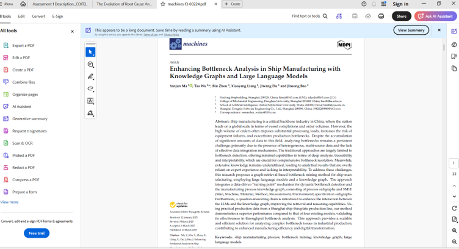
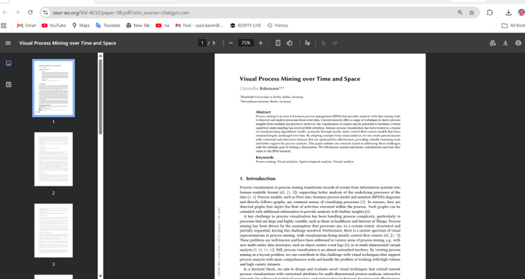
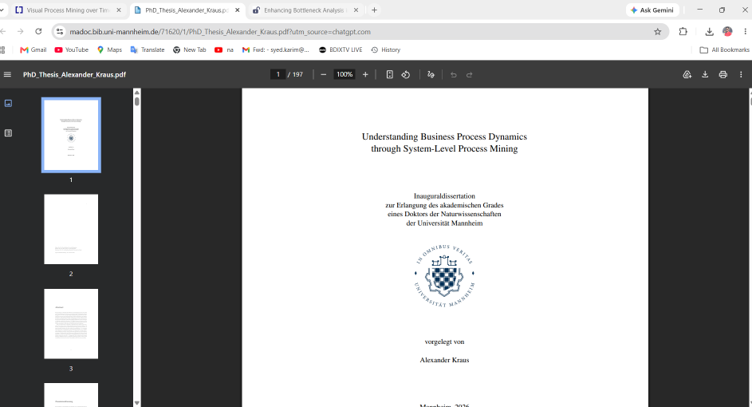

# E-Portfolio 1: Process Analysis

**Student Name:** Syed Rubaiyat Karim  
**Student ID:** 12302352 
**Unit:** COIT20252 Business Process Management  
**Topic:** Process Analysis  
**Submission:** Week 4  

---

## Artefact 1 — Website: “The Evolution of Root Cause Analysis”

### Source

Behrhorst, J, Gale, B and Van, CM 2025, ‘The evolution of root cause analysis’, PSNet, Agency for Healthcare Research and Quality, 26 February
https://psnet.ahrq.gov/perspective/evolution-root-cause-analysis

[Download Artefact 1 PDF](artefact1-root-cause-analysis.pdf)

### Summary

This website explains root-cause analysis as a method for finding the real reasons behind a problem. It does not only focus on the visible problem because weaknesses in the whole system may also be responsible. The website discusses Root Cause Analysis and Action, also known as RCA². This approach focuses on improving the process instead of blaming one person. It also asks organisations to take strong actions after finding the causes, so the same problem does not happen again (Behrhorst, Gale and Van 2025, pp. 1–3).

### Justification and Reflection

I chose this website because root-cause analysis is included in Week 3, Slide 30. Before reading this source, I thought root-cause analysis simply meant finding the main cause of a problem. However, I learned that one problem may have several connected causes. I also learned that organisations should examine their processes before blaming an individual. This artefact shows my understanding of BPM because finding a cause is not enough. An organisation must also take suitable action and check whether the action prevents the problem from happening again.

### Reference
Behrhorst, J, Gale, B and Van, CM 2025, ‘The evolution of root cause analysis’, PSNet, Agency for Healthcare Research and Quality, 26 February, https://psnet.ahrq.gov/perspective/evolution-root-cause-analysis.

## Artefact 2 — Peer-Reviewed Journal Article

## Source: 
Ma, Y, Wu, T, Zhou, B, Liang, X, Du, J and Bao, J 2025, ‘Enhancing bottleneck analysis in ship manufacturing with knowledge graphs and large language models’, Machines, vol. 13, no. 3, article 224

[Download Artefact 2 PDF](artefact2-bottleneck-analysis.pdf)
## Summary
This journal article explains how bottlenecks can be identified and analysed in ship manufacturing. The researchers created a method called SPKG, which uses production data, a knowledge graph and large language models. The study identified problems with an edge-milling machine, frequent downtime of a cutting machine and a slow manual assembly process. The company responded by improving maintenance, changing machine settings, training workers and using partial automation. The results showed that SPKG provided clearer and more useful bottleneck analysis than the other methods tested (Ma et al. 2025, pp. 16–19).

## Justification and Reflection
I chose this article because bottleneck analysis is discussed in Week 3, Slide 22. I already knew that equipment downtime could create a bottleneck, but this article showed me how the delay could also affect later activities. I learned that finding a slow part of a process is only the first step. The organisation must understand why it is slow and choose the correct improvement. This artefact shows my BPM knowledge because it connects process analysis with real decisions about maintenance, employee training, resource use and automation.

## Reference
Ma, Y, Wu, T, Zhou, B, Liang, X, Du, J and Bao, J 2025, ‘Enhancing bottleneck analysis in ship manufacturing with knowledge graphs and large language models’, Machines, vol. 13, no. 3, article 224, viewed 7 August 2026, https://doi.org/10.3390/machines13030224.

## Artefact 3 — Conference Paper

## Source: 
Rubensson, C 2025, ‘Visual process mining over time and space’, paper presented at the 23rd International Conference on Business Process Management, Seville, Spain, 31 August–5 September

[Download Artefact 3 PDF](artefact3-visual-process-mining.pdf)

## Summary
This conference paper examines how visual analytics can improve process mining. Traditional process-mining results are commonly displayed as static diagrams focused primarily on activity flow, which can become difficult to understand when processes contain large volumes of varied data. The research proposes contextual, interactive and optimised visual layouts that allow analysts to examine processes using time, location and other relevant information. It also explores filtering and semantic zooming, enabling users to move between detailed individual events and higher-level process views. These features are intended to improve process comprehension and analytical decision-making (Rubensson 2025, pp. 1–5).

## Justification and Reflection
I chose this paper because process mining is discussed in Week 3, Slides 27 and 29. I already knew that process visualisations could be interactive and viewed at different levels. However, this paper helped me understand how time and location could be added to the visualisation. I also learned that semantic zooming could make large amounts of process data easier to examine. This artefact demonstrates my BPM knowledge because visualisation is used not only to present results. Analysts can also use it to explore process behaviour, identify patterns and understand performance problems.

## Reference
Rubensson, C 2025, ‘Visual process mining over time and space’, Proceedings of the Best BPM Dissertation Award, Doctoral Consortium, and Demonstrations & Resources Forum co-located with the 23rd International Conference on Business Process Management, Seville, Spain, 31 August–5 September, CEUR Workshop Proceedings, vol. 4032, viewed 7 August 2026, https://ceur-ws.org/Vol-4032/paper-08.pdf.

## Artefact 4 PhD Thesis: “Understanding Business Process Dynamics through System-Level Process Mining”

## Source: 
Kraus, A 2026, Understanding business process dynamics through system-level process mining, PhD thesis, University of Mannheim.

[Download Artefact 4 PDF](artefact4-process-dynamics-thesis.pdf)

## Summary
This PhD thesis explains how organisations can study changes in their business processes by using system-level process mining. Normal process mining often examines individual cases separately, but this may not show how the whole process changes over time. System-level process mining combines information from many cases and helps organisations find changes in performance, repeated delays and dynamic bottlenecks. It can also show how a process responds to operational changes or disruptions. This gives organisations a clearer and more accurate understanding of their overall process performance (Kraus 2026, pp. 1–3, 37–39).

## Justification and Reflection
I chose this thesis because continuous monitoring and process variation are discussed in Week 3, Slides 9 and 23. I already knew that organisations should examine many cases over time to identify changes in performance, repeated delays and dynamic bottlenecks. However, this thesis helped me understand the difference between studying individual cases and analysing the whole process as one changing system. I learned that some patterns may not be visible when cases are examined separately. This artefact is useful evidence of my BPM knowledge because it shows why organisations should monitor their processes continuously instead of depending on a single analysis.

## Reference
Kraus, A 2026, Understanding business process dynamics through system-level process mining, PhD thesis, University of Mannheim, Mannheim, viewed 7 August 2026, https://madoc.bib.uni-mannheim.de/71620/1/PhD_Thesis_Alexander_Kraus.pdf.

## AI Disclosure

AI tools were used during the planning, research and initial idea-development stages. All sources were checked, and the final reflections were reviewed and written in my own words.

## References

Behrhorst, J, Gale, B and Van, CM 2025, ‘The evolution of root cause analysis’, *PSNet*, Agency for Healthcare Research and Quality, 26 February, viewed 7 August 2026, <https://psnet.ahrq.gov/perspective/evolution-root-cause-analysis>.

Ma, Y, Wu, T, Zhou, B, Liang, X, Du, J and Bao, J 2025, ‘Enhancing bottleneck analysis in ship manufacturing with knowledge graphs and large language models’, *Machines*, vol. 13, no. 3, article 224, viewed 7 August 2026, <https://doi.org/10.3390/machines13030224>.

Rubensson, C 2025, ‘Visual process mining over time and space’, *Proceedings of the Best BPM Dissertation Award, Doctoral Consortium, and Demonstrations & Resources Forum co-located with the 23rd International Conference on Business Process Management*, Seville, Spain, 31 August–5 September, CEUR Workshop Proceedings, vol. 4032, viewed 7 August 2026, <https://ceur-ws.org/Vol-4032/paper-08.pdf>.

Kraus, A 2026, *Understanding business process dynamics through system-level process mining*, PhD thesis, University of Mannheim, Mannheim, viewed 7 August 2026, <https://madoc.bib.uni-mannheim.de/71620/1/PhD_Thesis_Alexander_Kraus.pdf>.
