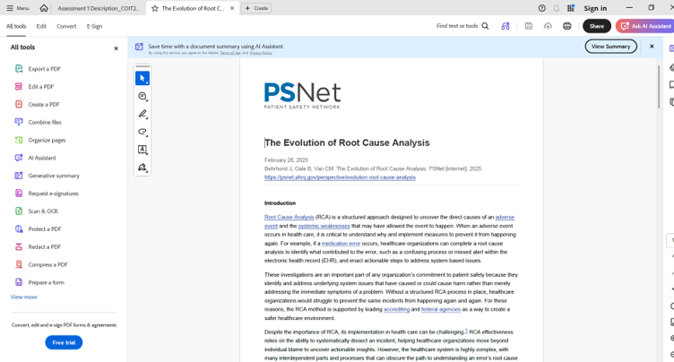

# E-Portfolio 1: Process Analysis

**Student Name:** Syed Rubaiyat Karim  
**Student ID:** 12302352 
**Unit:** COIT20252 Business Process Management  
**Topic:** Process Analysis  
**Submission:** Week 4  

---

## Artefact 1 — Website: “The Evolution of Root Cause Analysis”

### Source

Behrhorst, J, Gale, B and Van, CM 2025, ‘The evolution of root cause analysis’, PSNet, Agency for Healthcare Research and Quality, 26 February
https://psnet.ahrq.gov/perspective/evolution-root-cause-analysis

[Download Artefact 1 PDF](artefact1-root-cause-analysis.pdf)

### Summary

To be completed.

### Justification and Reflection

To be completed.

---

## Artefact 2 — Peer-Reviewed Journal Article

To be completed.

---

## Artefact 3 — Conference Paper

To be completed.

---

## Artefact 4 — PhD Thesis

To be completed.

---

## AI Disclosure

AI tools were used during the planning, research and initial idea-development stages. All sources were checked, and the final reflections were reviewed and written in my own words.

## References

To be completed.
