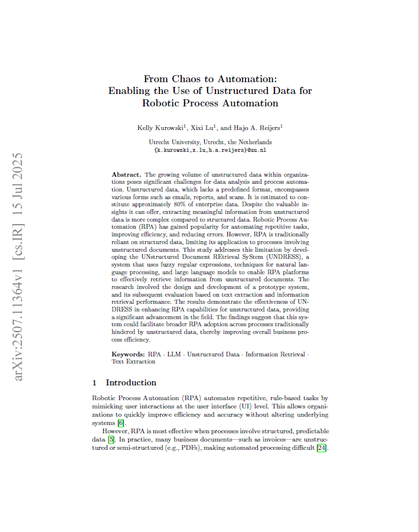
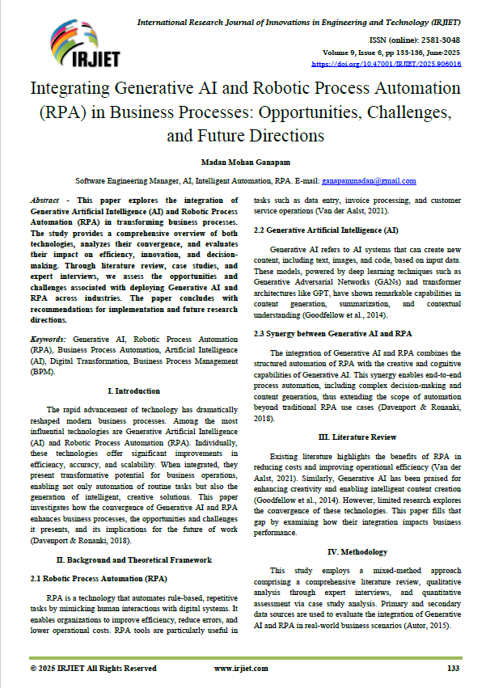
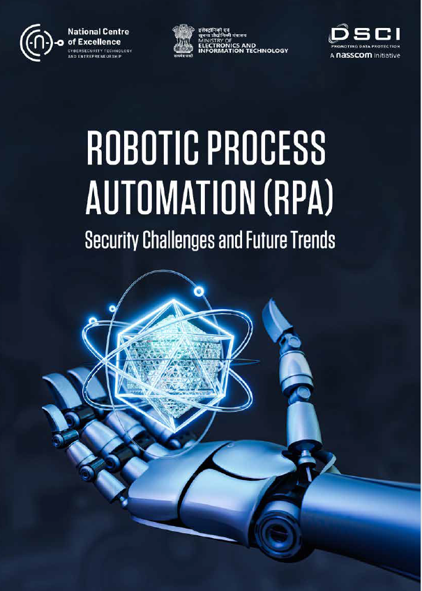
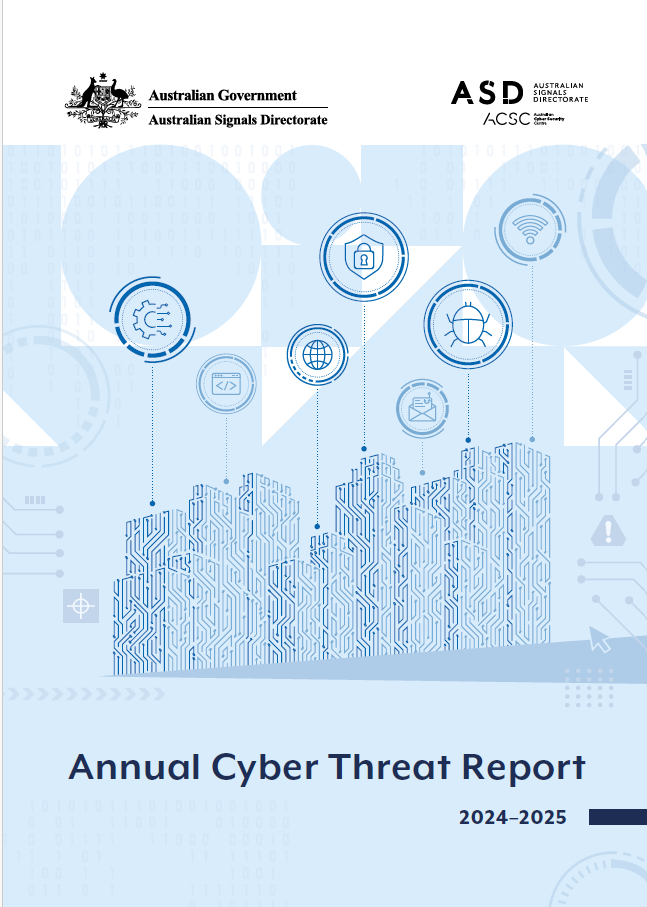

# E-Portfolio 3: Robotic Process Automation and Process Cybersecurity

**Student Name:** Syed Rubaiyat Karim  
**Student ID:** 12302352  
**Unit:** COIT20252 Business Process Management  
**Term:** Term 2, 2026  
**Submission:** Week 10  

---

## Artefact 1 — Research Paper: “From Chaos to Automation”

**Source:** Kurowski, K, Lu, X and Reijers, HA 2025, ‘From chaos to automation: Enabling the use of unstructured data for robotic process automation’.

[View Artefact 1](https://arxiv.org/pdf/2507.11364)

[Download Artefact 1 PDF](P3-Artefact1.pdf)

### Summary

This paper explains that RPA works well with structured and predictable data, but many business documents are not structured. Examples include emails, scanned invoices and reports. The researchers created a system called UNDRESS, which uses different methods to collect information from these documents. The testing showed that this system could help RPA complete more business tasks, although some document formats still caused errors (Kurowski, Lu and Reijers 2025, pp. 1–2, 9–12).

### Justification and Reflection

I chose this paper because RPA and its uses are discussed in Week 8, Slides 17–21. It helped me understand that selecting a suitable process is important because RPA cannot handle every type of data in the same way. I also learned that combining simple methods with AI can improve automation. This artefact shows my BPM learning because successful automation depends on the process, data quality and proper testing.

---

## Artefact 2 — Journal Article: “Integrating Generative AI and RPA in Business Processes”

**Source:** Ganapam, MM 2025, ‘Integrating generative AI and robotic process automation (RPA) in business processes: Opportunities, challenges, and future directions’, *International Research Journal of Innovations in Engineering and Technology*, vol. 9, no. 6, pp. 133–136.

[View Artefact 2](https://irjiet.com/article_file/IRJIET9060161750237154.pdf?utm_source=chatgpt.com)

[Download Artefact 2 PDF](P3-Artefact3.pdf)

### Summary

This article explains how generative AI and RPA can work together. RPA is useful for repetitive and rule-based work, while generative AI can understand language, create content and support decisions. Together, they can improve document processing, customer service and complex workflows. However, organisations may face problems with older systems, costs, data privacy and staff changes, so good governance is still required (Ganapam 2025, pp. 133–135).

### Justification and Reflection

I chose this article because Week 8, Slides 17–22 explain RPA, its benefits and the reasons RPA projects can fail. The article helped me understand that adding AI makes automation more flexible, but it also creates more risks. Organisations should not automate a process without checking privacy, security and employee needs. This artefact shows my BPM knowledge because automation should improve the whole process and not only reduce manual work.

---

## Artefact 3 — Industry White Paper: “RPA Security Challenges and Future Trends”

**Source:** National Centre of Excellence 2025, *Robotic process automation (RPA) security challenges and future trends*.

[View Artefact 3](https://www.n-coe.in/sites/default/files/2025-07/1%20Robotic%20Process%20Automation.pdf?utm_source=chatgpt.com)

[Download Artefact 3 PDF](P3-Artefact3.pdf)

### Summary

This white paper explains the security risks connected with RPA. Bots may access, edit or transfer private information, so poor control can cause data leaks, unauthorised access and compliance problems. Other risks include stolen bot credentials, bot impersonation and weak security during a fast implementation. The paper recommends controls such as encryption, multi-factor authentication, role-based access and regular auditing of RPA systems (National Centre of Excellence 2025, pp. 6–7, 14–17).

### Justification and Reflection

I chose this source because process cybersecurity is discussed in Week 8, Slides 22–25 and 28. It helped me understand that a bot needs strong security because it may have access to several business systems. A bot should also have its own identity so its actions can be checked. This artefact shows my BPM learning because an automated process must protect data and remain accountable, reliable and compliant.

---

## Artefact 4 — Government Report: “Annual Cyber Threat Report 2024–25”

**Source:** Australian Signals Directorate 2025, *Annual cyber threat report 2024–25*, Australian Cyber Security Centre, Canberra.

[Download Artefact 4 PDF](P3-Artefact4.pdf)

### Summary

This Australian Government report explains the current cyber threats faced by organisations. The ACSC responded to more than 1,200 cyber incidents during 2024–25, which was an increase from the previous year. Common serious incidents involved compromised systems, stolen accounts and ransomware. The report recommends controls such as multi-factor authentication, software updates, limited administrator access, application control and regular backups (Australian Signals Directorate 2025, pp. 11–13, 43–44).

### Justification and Reflection

I chose this report because Week 8, Slides 24–30 discuss cyber threats, risk controls and the NIST Cybersecurity Framework. Week 9 also explains risk assessment. This report helped me connect those ideas with real incidents in Australia. I learned that cybersecurity needs several controls because one control cannot stop every threat. This artefact shows my BPM knowledge because organisations must regularly identify risks and protect the systems that support their business processes.

---

## AI Disclosure

AI tools were used during the planning, research and initial idea-development stages. I checked the sources and page numbers, and I reviewed the final writing to make sure it reflects my own understanding.

## References

Australian Signals Directorate 2025, *Annual cyber threat report 2024–25*, Australian Cyber Security Centre, Canberra, viewed 26 September 2026, <https://www.cyber.gov.au/sites/default/files/2025-10/Annual%20Cyber%20Threat%20Report%202024-25.pdf>.

Ganapam, MM 2025, ‘Integrating generative AI and robotic process automation (RPA) in business processes: Opportunities, challenges, and future directions’, *International Research Journal of Innovations in Engineering and Technology*, vol. 9, no. 6, pp. 133–136, viewed 26 September 2026, <https://doi.org/10.47001/IRJIET/2025.906016>.

Kurowski, K, Lu, X and Reijers, HA 2025, ‘From chaos to automation: Enabling the use of unstructured data for robotic process automation’, *arXiv*, viewed 26 September 2026, <https://arxiv.org/abs/2507.11364>.

National Centre of Excellence 2025, *Robotic process automation (RPA) security challenges and future trends*, viewed 26 September 2026, <https://www.n-coe.in/sites/default/files/2025-07/1%20Robotic%20Process%20Automation.pdf>.
